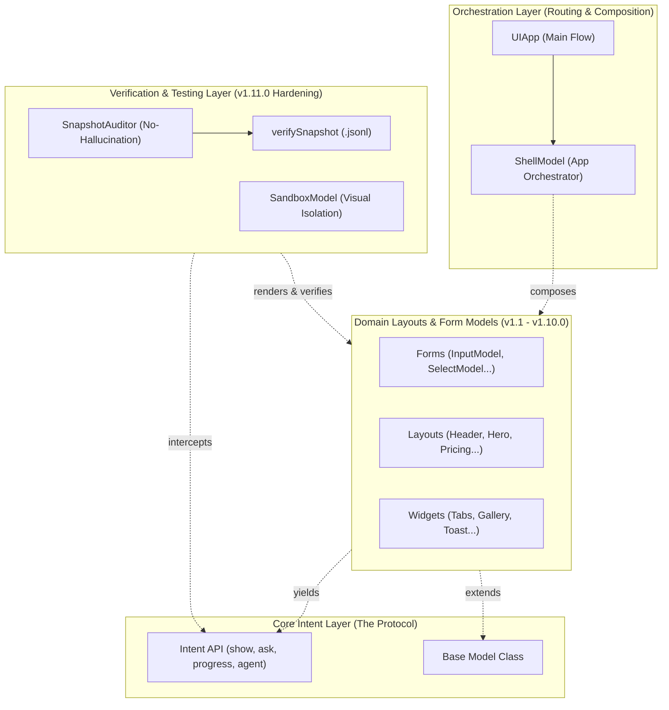

# Package Architecture: @nan0web/ui

[🏠 Main (README)](../../README.md) | [📦 Component Models Map](./architecture-models.md) | 🇺🇦 [Українська](./../../uk/architecture.md)

The `@nan0web/ui` ecosystem is designed around the **"One Logic — Many UI" (OLMUI)** concept. Instead of defining *how* to render components (React, CLI), this package exclusively defines *intents* and *data schemas* (Model-as-Schema).

To prevent diagram overload from micro-imports, the package architecture is simplified into key conceptual layers:

## Functional Layers

### 1. Orchestration Layer
This is the top level. `src/cli.js` exports `UIApp` as the default entry point. Its job is to bootstrap the system and pass routing control to `ShellModel`, which handles cross-platform view transitions.

### 2. Core Intent Layer
Instead of executing side-effects directly (like `console.log` or IO calls), the domain code `yields` intent objects. This was fully stabilized in **v1.11.0** into reliable functions (`show()`, `agent()`, `ask()`), which are ultimately resolved by environment Adapters.

### 3. Domain Models Layer
This is the schema "dictionary" (see [architecture-models.md](./architecture-models.md) for the full map). In **v1.10.0** (*The Domain Bloom*), this layer was expanded with over 20 structural elements (`HeaderModel`, `FooterModel`, `PricingModel`), cementing the package as a comprehensive schema layout framework.

### 4. Verification & Testing Layer
This layer was the primary focus of **v1.11.0**. 
- `SnapshotAuditor` and `verifySnapshot` provide "Zero-Hallucination" guarantees, ensuring intents produced by models contain no artifacts like `NaN` or `undefined`. 
- `SandboxModel` serves as a container to isolate UI domain components for localized visual Playwright testing.
