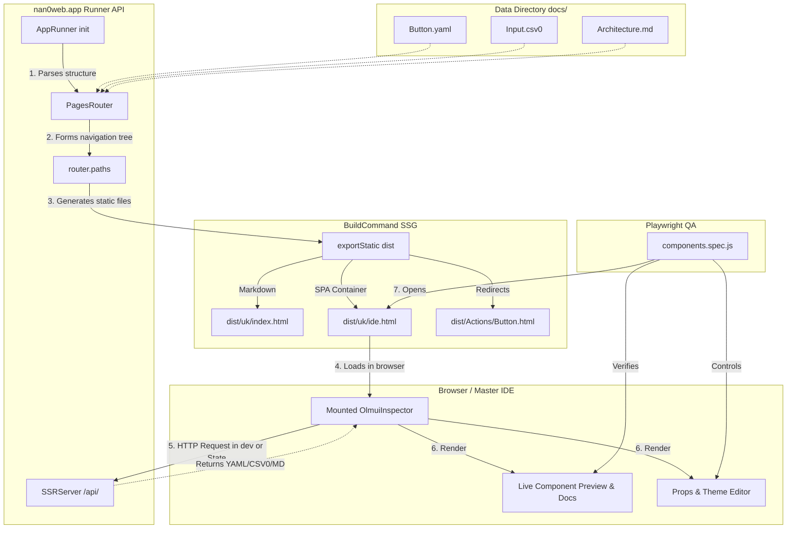

# Universal Project & Blocks Architecture (Universal Project & Blocks Spec)

> **Purpose:** This document is the mandatory standard (Constitution) for starting or refactoring any project in the `nan.web` ecosystem (e.g., `usarch.org`, `llimo.app`, financial applications, etc.). It ensures unity of architecture, isolation of abstractions, and Data-Driven UI.

---

## History

### [1.12.1] — 2026-04-25
- **Intent Refactoring**: Added `raw` flag to `ResultIntent` for pure data output (piping support).
- **Polymorphic Apps**: Standardized `run()` generator pattern for all Domain Models.
- Improved `IntentDispatcher` with silent output support for text files.

---

## 🧭 Phase 1: Philosophy and Abstraction (The Seed)

_Before writing code, we determine the essence of the project and its place in the global ecosystem._

1. **Mission and Philosophy:**

   **Data → Algorithms → Application → Interfaces.**

   The fundamental goal is to build a system where **Data** is the primary source; **Algorithms** process it regardless of the environment; the **Application** (`*.app`) orchestrates business logic; and **Interfaces** (`ui-*`) are points of interaction.

   **Interaction as an Engine:**
   An application is a continuous process of interaction between the system and the user. The interface must not just display the state, but be an active participant in the dialogue: requesting data, providing choices, and recording user intent.

   No interface creates its own logic — it only **manifests** domain logic and provides feedback.
   - `ui-cli` — the minimal canonical interface. If logic cannot be expressed in the terminal, it is not fully formalized yet.
   - `ui-chat` — the communication interface built **on top of `ui-cli`**. AI dialogue (LLiMo) uses the same primitives (`Input`, `Select`, `Table`, `Tree`) as the terminal, transforming text queries into formal interactive blocks.
   - `ui-react`, `ui-lit`, `ui-tauri`, `ui-web` — graphical interfaces; they add visual aesthetics and complex layouts, but their foundation remains the same interaction protocol.
   - `ui-voice` — the voice interface built **on top of `ui-chat`**.
   - `ui-robot` — interface for robots.

2. **Abstraction (Base App):**
   - **FORBIDDEN** to immediately write hard-coupled UI for a specific project (e.g., "UI for the school of archetypics").
   - **MANDATORY**: Define a universal nan•app (e.g., `@nan0web/learn.app`, `@nan0web/chat.app`, `@nan0web/shop.app`), by extending which we will get our project. The project (like `usarch`) only configures the design and applies these basic modules.
3. **Terminology (Glossary):**
   - Definition of terms at the level of the philosophy of the co-creators of the idea and its virtualization into an application.
   - Definition of terms (Student -> Member, Course -> Course, etc.).

---

## 📁 Standard Directory Structure (nan•app Structure)

A universal application (`*.app`) or "Root Project" written using the `UI` ecosystem must follow a clear and minimalist separation of logic from data and platforms:

```text
├── data/                 # Public project data (Data Directory)
│   ├── _/
│   │   └── langs.nan0    # Languages [{ title, locale, icon? }]
│   ├── en/               # English
│   │   ├── _/
│   │   │   └── t.nan0    # Translations
│   │   ├── index.nan0    # Home page
│   │   └── project.nan0  # Project
│   ├── uk/               # Ukrainian
│   │   ├── _/
│   │   │   └── t.nan0    # Translations
│   │   ├── index.nan0    # Home page
│   │   └── project.nan0  # Project
│   └── index.nan0        # Home page
├── docs/                 # Documentation as Single Source of Truth (Knowledge Base)
│   ├── _/
│   │   └── langs.nan0    # Languages [{ title, locale, icon? }]
│   ├── en/               # English
│   │   ├── README.md     # Project documentation generated from tests
│   │   └── project.md    # Project architecture
│   └── uk/               # Ukrainian
│       ├── README.md     # Project documentation generated from tests
│       └── project.md    # Project architecture
├── play/                 # Playground for experiments (Sandbox)
│   ├── _/
│   │   └── langs.nan0    # Languages [{ title, locale, icon? }]
│   ├── en/               # English
│   │   ├── _/
│   │   │   └── t.nan0    # Translations
│   │   ├── index.nan0    # Home page
│   │   └── project.nan0  # Project
│   ├── uk/               # Ukrainian
│   │   ├── _/
│   │   │   └── t.nan0    # Translations
│   │   ├── index.nan0    # Home page
│   │   └── project.nan0  # Project
│   └── index.nan0        # Home page
├── src/
│   ├── domain/           # Core Logic & Model-as-Schema (Platform-independent logic)
│   │   ├── Model.js      # Business entity or Command (unbound to Web/CLI)
│   │   └── utils.js      # Pure data processing functions
│   ├── ui/
│   │   ├── api/          # API interface, middleware and custom router export { middleware, router }
│   │   ├── chat/         # Chat interface
│   │   ├── cli/          # Terminal interface
│   │   ├── core/         # Core interface components
│   │   ├── robot/        # Robot interface
│   │   ├── web/          # Web interface
│   │   ├── voice/        # Voice interface
│   │   ├── tauri/        # Tauri interface
│   │   ├── kotlin/       # Android interface
│   │   └── swift/        # iOS interface
│   └── utils/            # Shared utilities
├── package.json          # Dependencies, launch commands (knip, test, docs:dev)
└── README.md             # Symlink or mirror to core documents in all available languages docs/{defaultLang}/README.md
```

**Key structural rules:**

1. **`data/`** This is the application database. Any interface component, setting, or content must originate from here.
2. **`docs/`** This is the project documentation for developers.
3. **`play/`** This is the playground for experiments.
4. **`src/domain/` is isolated:** This code knows nothing about DOM, Terminal, or iOS. It exports `Model`, which "communicates" via Intent generators (`yield ask`, `yield show`, `yield progress`).
5. **Multi-platform:** If the app will support Swift or Kotlin clients, they will be located nearby (e.g., `src/ui/swift/`), but will use the exact same true domain logic (via FFI, JS engines, or API) and the same data from `data/`.

If the app uses only standard nan•web components, you just need to write logic in models in `src/domain/` and `data/` and the app will magically work via `nan0web.app` in all available UIs or `nan0cli` in CLI.

---

## 📐 Phase 2: Domain Modeling (Data-Driven Models)

_Description of the data driving the interface._

1. **Creating Model.js:**
   - Every entity (Member, Product, Document) becomes a pure JS class in `src/domain/`.
   - Properties are described using the template `static field = { help: "Field description", default: "", type: "type" }`.
   - _What is `type: "type"`?_ It's a declarative instruction for the Sovereign Sandbox IDE specifying which visual control to use for this field. For example:
     - `type: "text/markdown"` — renders a fullscreen text editor.
     - `type: "ref/Model"` — renders a recursive list form for objects.
     - `type: "ref/LessonModel[]"` — renders Autocomplete to pick multiple tags from the `LessonModel` registry.
2. **Metadata Types (`@type`):**
   - Clear definition of field types for automatic UI generation: `text`, `number`, `boolean`, `text/markdown`, `ref/Model`, `ref/Model[]`; base types can be inferred from the `default` field.
3. **Data Sources (Data Sources as Foundation):**
   - Base data is stored in `YAML`/`JSON` formats. They are the absolute truth for the application.
   - We reject the concept of 'Mocks', forming live Data Sources right away. Along with decentralized or cloud solutions (e.g., MongoDB), a special adapter (or sync) copies/uploads data directly into these formats. All interface and logic are built exclusively around interacting with data that already exists.

---

## 🛠 Phase 3: Logic Verification (CLI-First)

_Business logic must work 100% without a web interface and be covered 100% by unit tests._

1. **Integration with `ui-cli`:**
   - Creating commands via `adapter.select()` and `adapter.ask()`.
   - Ability to perform all project tasks from the terminal (Create course, Issue certificate).
   - Covering dialogues and data flows with snapshot tests. Snapshots here are text screens of logic replacing manual checks.

---

## 🪐 Phase 4: Sovereign Workbench (The Master IDE)

_Each project has its own Sandbox for rapid data and visualization management._

1. **Connecting Models to Sandbox:**
   - Registration of all domain models in `blocks-sandbox`.
2. **Testing Data-Driven UI:**
   - Checking how the interface is automatically generated based on the meta-descriptions of the domain (modals, lists, relations).
   - Displaying `live-preview` of cards and objects.
3. **Docs in Sandbox Integration:**
   - Every package and app MUST have its documentation **directly integrated into the Sandbox**. Documentation should not live a separate life.
   - The Sandbox together with documentation is built as a very fast **SSG (Static Site Generator)** web application (based on the fastest `ui-lit`), easily publishable on GitLab Pages, GitHub Pages, Vercel, Cloudflare, etc.
   - Documentation structure must be professional and deep — akin to modern frameworks like Bootstrap or React (with "live" interactive component examples, convenient navigation, architectural description).

### Master IDE and Data-Driven SSG Architecture

The Master IDE (also known as sandbox or `ide.html`) is a dynamic application and the single entry point to inspect developed interfaces. According to the Data-Driven UI philosophy, it works with any data files (`yaml`, `csv0`, `nan0`, `md`), not just component configurations.

Here's how universal rendering and SSG generation work:



---

## 🎨 Phase 5: Theming and Interfaces (Theming)

_Separating logic from brand via CSS variables._

1. **Base UI and Branding:**
   - Every nan•app (or project) must have a shared `Base UI` layer defining its base shades, colors, branding, and typography.
   - All other clients and representations (`ui-react`, `ui-lit`, `ui-cli`, `ui-swift`, etc.) **import and inherit** variables from this layer (via CSS Custom Properties or tokens). If we edit the base brand color, these changes automatically propagate to CLI, Web, and other platforms.
   - Graphical extensions (e.g. web version) can override styles directly, but their fallback is unequivocally the `Base UI` of the package.
2. **Configuration (Theme Configurator):**
   - Checking style changes directly from Sandbox without altering component JS code.
3. **Universal Snapshot-tests (UI Snapshots):**
   - Like in CLI, web components (Lit / React) must be covered by snapshot tests (capturing their DOM structure). Snapshots serve as code "screens" for all interfaces. This is the appropriate and easiest way to verify (both during code review and in CI) how correctly algorithms worked and whether the interface "broke" after tweaks.
4. **Anti-Flash White Pattern:**
   - For the best User Experience in every detail, HTML pages that support light and dark themes MUST have a dark theme by default (or at least a dark background).
   - This is implemented directly in the source HTML file (e.g., `index.html`) by setting the `data-bs-theme="dark"` attribute on the `<html>` tag and inline styles for `<body background-color="...">` before any JS or external CSS loads.
   - This ensures that at night the user will not receive a blinding flash of light even for half a second.
   - Comments in HTML/CSS must be in English for multi-lingual products.
   
   *Architectural standard example for `index.html`:*
   ```html
   <!doctype html>
   <html lang="en" data-bs-theme="dark">
     <head>
       <style>
         /* Dark background by default to prevent white flash */
         body { background-color: #212529; color: #f8f9fa; }
         
         /* Light theme overrides applied only when data-bs-theme="light" */
         html[data-bs-theme="light"] body { background-color: #f8f9fa; color: #212529; }
       </style>
     </head>
     <body>...</body>
   </html>
   ```

---

## 🤖 Phase 6: Autonomous Interaction (Agentic Workflows & Inspectors)

_The `nan.web` platform is AI-Native. Each package independently determines how Artificial Intelligence (LLiMo, LLM subagents) should work with it, verify code, and learn._

Each package or nan•app can and must export specific tools for its domain area to AI:

### 1. `workflows/` (Exporting Workflows)

Any package can export its `.md` workflows, describing the basic workflow for working with its entities.
**Where is this indicated?** In the `package.json` configuration (or `nan0web.config.js`):

```json
{
  "name": "@nan0web/markdown",
  "nan0web": {
    "workflowDir": "docs/{locale}/workflows",
    "workflows": ["basic.md", "advanced.md"],
    "inspectors": ["./src/inspectors/..."]
  }
}
```

### 2. Golden Standards (Inheriting Reference Models)

The `@nan0web/types` (or `@nan0web/core`) package formalizes the _main_ Golden Standard for describing models (Model-as-Schema). All other packages ALSO form their own Golden Standards, inheriting from the core. For example:

```javascript
import { Model } from '@nan0web/core'

/**
 * Golden standard: the package formalizes the type for "text/markdown".
 * Agents (LLM) will read this file to understand how the markdown field works.
 */
export class MarkdownContentModel extends Model {
  // Static meta-schema (for UI forms and LLM prompt builders)
  static text = {
    type: 'text/markdown',
    help: 'Content strictly in CommonMark format',
    default: '',
  }

  constructor(data = {}, options = {}) {
    super(data, options)
    /** @type {string} */ this.text
  }
}
```

### 3. Indexing for Vector Databases (RAG)

What exactly should an AI-agent index in a vector database (Embeddings) for maximum accuracy without hallucinations?

- ✅ **INDEX:** Architectural documentation (`docs/*.md`, `project.md`, `system.md`).
- ✅ **INDEX:** Domain models and contracts (`src/domain/*.js` and interfaces with clear JSDoc), as well as `workflows/` folders.
- ✅ **INDEX:** Data directories (`docs/uk/**/*.yaml`, `.csv0`), as this is the single source of truth about the app state (Data-Driven).
- ❌ **IGNORE:** Heavy files with machine/imperative parser code (`src/server/`, `src/utils/`, CSS/SASS). The agent should not hallucinate internal implementations. If the LLM needs parser code — it will read it locally via `read_file`, but this garbage should not be in the vector.

### 4. Registry of AI Knowledge (NaN0Web Store and NaN0AI)

To avoid "bloating" the size of NPM packages (and avoid downloading megabytes of documentation into the end user's `node_modules`), the ecosystem uses a different approach to distributing AI knowledge:

1. **Global Registry (NaN0Web Store):** This is a public GitHub repository (free, reliable hosting and versioning). It contains only the registry (manifests, `Docs/`, and indexes), and NOT duplicates of the source code of all projects.
2. **References instead of Duplicates:** To avoid megabytes of garbage, the Store keeps links to specific Git commits/versions of original repositories.
3. **"Headers vs Implementation" concept:** By analogy with C++ (where lightweight `.h` files are separated from heavy `.cpp` ones), `NaN0AI` indexes only the "headers" — our domain abstractions (`Model-as-Schema`, `.d.ts`, and `workflows`), leaving the imperative source code out of the index. AI must see clean contracts and ideas, not sanitary implementation.
4. **Processing requests by the `NaN0AI` tool:** When a subagent needs standards, it performs a `git clone` of the NaN0Web Store registry, and queries it via a fast vector database. If the AI needs the full source code of the program for deep analysis — `NaN0AI` downloads it via a link from the registry directly into the local cache.

This architecture protects the ecosystem from unnecessary load, isolates AI memory in one efficient storage (`Store`), and makes agents faster and more resilient to "garbage".

### 5. AI Export for @nan0web/ui package
Since `ui` is a foundational package, it exports the following set of abstractions by default:
- **Paths (Multilingual Workflows):** Workflows are part of architectural documentation, so they live in language sections: `docs/uk/workflows/` (and `docs/en/workflows/`).
- **Core Workflows:** `olm-ui-architecture.md`, `olm-ui-architecture-core.md`, `olm-ui-architecture-adapters.md`. These files explain to agents how OLMUI works.
- **Development Workflows:** `forge-component.md`, `interface-welding.md` (Welding Contract). They describe the step-by-step process of creating new or integrating existing components.
- **Inspectors:**
  - `SnapshotAuditor.js` (`src/domain/app/SnapshotAuditor.js`): A sovereign app-inspector verifying the state of Golden and Working Snapshot galleries across the monorepo.

---

## 🏁 Project Readiness Checklist (Definition of Done)

- [ ] Clear mission in `system.md` or `README.md`.
- [ ] The project extends a base app (Base App abstraction).
- [ ] All domain models are described with `@sandbox` support.
- [ ] All scenarios can be completed via CLI.
- [ ] Sandbox fully manages data and renders previews.
- [ ] UI components contain no hardcoded brand colors, styling is via CSS Custom Properties.

---

## 🧱 Universal UI Blocks (Universal Blocks Spec)

According to the **One Logic, Many UI (OLMUI)** concept, pages and interfaces are assembled from standard data structures (block models). This specification describes a unified system of Blocks that must be supported by all client UI packages.

## Goal

A unified approach ensures that if we describe an object in YAML or JSON (e.g., the `$content` array), this object is correctly processed:

- Rendered in browser via `ui-react` or `ui-lit`.
- Output to console via `ui-cli`.
- Analyzed by LLM agents as context via `ui-chat`.
- Voiced via `ui-voice`.
- Executed by hardware clients via `ui-robo`.

---

## Blocks Support Matrix (Specification)

This table shows the implementation status of each block in various packages of the `@nan0web/*` ecosystem.

Legend:

- ⏳ — Planned
- 🚧 — In progress
- ✅ — Implemented
- ✖️ — Not Applicable

`ui-bs` stands for `ui-react-bootstrap`

| Block / Component              | Payload Structure           | `ui-cli` | `ui-llm` | `ui-voice` | `ui-lit` | `ui-react` | `ui-bs` | `ui-robo` | Swift | Kotlin | `ui-tauri` |
| :----------------------------- | :-------------------------- | :------: | :------: | :--------: | :------: | :--------: | :-----: | :-------: | :---: | :----: | :--------: |
| **`Blocks.Description`**       | Subtitle (text)             |    ⏳    |    ✅    |     ⏳     |    ⏳    |     ⏳     |   ✅    |    ⏳     |  ⏳   |   ⏳   |     ⏳     |
| **`Blocks.Excerpt`**           | Short description/Summary   |    ⏳    |    ✅    |     ⏳     |    ⏳    |     ⏳     |   ✅    |    ⏳     |  ⏳   |   ⏳   |     ⏳     |
| **`Blocks.Content`**           | Main page array             |    ⏳    |    ✅    |     ⏳     |    ⏳    |     ⏳     |   ✅    |    ⏳     |  ⏳   |   ⏳   |     ⏳     |
| **`Blocks.Accordion`**         | Q&A (FAQ)                   |    ⏳    |    ✅    |     ⏳     |    ⏳    |     ⏳     |   ✅    |    ⏳     |  ⏳   |   ⏳   |     ⏳     |
| **`Blocks.Files`**             | Documents for download      |    ⏳    |    ✅    |     ⏳     |    ⏳    |     ⏳     |   ✅    |    ⏳     |  ⏳   |   ⏳   |     ⏳     |
| **`Blocks.Features`**          | Advantages / Feature list   |    ⏳    |    ✅    |     ⏳     |    ⏳    |     ⏳     |   ✅    |    ⏳     |  ⏳   |   ⏳   |     ⏳     |
| **`Blocks.Price`**             | Tariffs / Prices            |    ⏳    |    ✅    |     ⏳     |    ⏳    |     ⏳     |   ✅    |    ⏳     |  ⏳   |   ⏳   |     ⏳     |
| **`Blocks.Contract`**          | Legal documents / Terms     |    ⏳    |    ✅    |     ⏳     |    ⏳    |     ⏳     |   ✅    |    ⏳     |  ⏳   |   ⏳   |     ⏳     |
| **`Blocks.Callout`**           | Tip, Warning, Info blocks   |    ⏳    |    ✅    |     ⏳     |    🚧    |     ⏳     |   ⏳    |    ⏳     |  ⏳   |   ⏳   |     ⏳     |
| **`Blocks.Markdown`**          | Typography (Text)           |    ⏳    |    ✅    |     ⏳     |    🚧    |     ⏳     |   ⏳    |    ⏳     |  ⏳   |   ⏳   |     ⏳     |
| **`Layout.Page`**              | Skeleton (Nav, Sidebar, Main) |    ✖️    |    ✖️    |     ✖️     |    🚧    |     ⏳     |   ⏳    |    ✖️     |  ⏳   |   ⏳   |     ⏳     |
| **`Layout.Nav`**               | Top navigation              |    ✖️    |    ✖️    |     ⏳     |    🚧    |     ⏳     |   ⏳    |    ✖️     |  ⏳   |   ⏳   |     ⏳     |
| **`Layout.Sidebar`**           | Side navigation menu        |    ✖️    |    ✖️    |     ⏳     |    🚧    |     ⏳     |   ⏳    |    ✖️     |  ⏳   |   ⏳   |     ⏳     |
| **`Control.ThemeToggle`**      | Day/Night toggle            |    ✖️    |    ✖️    |     ✖️     |    🚧    |     ⏳     |   ⏳    |    ✖️     |  ⏳   |   ⏳   |     ⏳     |
| **`Control.LangSelect`**       | Language switch             |    ⏳    |    ✖️    |     ⏳     |    🚧    |     ⏳     |   ⏳    |    ✖️     |  ⏳   |   ⏳   |     ⏳     |
| **`SectionNav`** _(Utility)_   | Navigation arrows ↑↓        |    ✖️    |    ✖️    |     ✖️     |    ⏳    |     ⏳     |   ✅    |    ✖️     |  ✖️   |   ✖️   |     ✖️     |
| **`renderItem`** _(Core)_      | Recursive tag renderer      |    ⏳    |    ✅    |     ⏳     |    ✅    |     ⏳     |   ✅    |    ⏳     |  ⏳   |   ⏳   |     ⏳     |
| **`layoutToContent`** _(Core)_ | Legacy `$layout` adaptation |    ⏳    |    ✅    |     ✖️     |    ⏳    |     ⏳     |   ✅    |    ✖️     |  ⏳   |   ⏳   |     ⏳     |

---

## 🧱 Basic HTML Primitives (Native Primitives)

According to the **Data-Driven UI** architecture, standard content does not require custom blocks like `Blocks.Paragraph` or `Blocks.Heading`.

The base renderer (e.g., `renderItem` or `ui-lit`/`ui-react`) **automatically** translates native semantic keys directly into corresponding HTML tags:

- Typography: `h1`, `h2`, `h3`, `p`, `blockquote`
- Lists: `ul`, `ol`, `li`
- Interaction: `a`, `button`
- Layout: `div`, `span`, `hr`

This allows keeping the AST transparent (e.g., `{ "h1.gradient-text": "Heading" }` or `{ "h1": "Heading", $class: "gradient-text" }`) and avoiding unnecessary wrappers for regular text.

---

## 🕹️ Interactive Viewers (Interactive Viewers & Inline Forms)

In addition to simply displaying linear components, the `@nan0web/ui` ecosystem demands architectural support for complex interactive elements allowing the user to interact with data and forms on the same page (similar to a browser, but works in both web and CLI terminal).

1. **`ContentViewer` (Interactive Layout):**
   The main sovereign control receiving a `content` array (AST of a document) and rendering it into a window with scroll and focus support.
   - **Navigation:** Can distinguish passive text from "interactive" blocks (buttons, links, sub-forms). Arrows and keyboard toggle "focus" between elements.
   - **Footer:** Supports a persistent status footer (e.g., read status in %, active hotkeys, and number of interactive blocks around).
   - **Events:** Pressing a link (e.g. `$href`) stops the viewer and passes the event to the router (`navigate`).

2. **`FormViewer` (Menu & Object Map Editor):**
   Instead of sequential filling (like a regular Input Prompt), `FormViewer` builds a full "settings menu" based on the model description.
   - The user sees all current fields and their values on the screen simultaneously.
   - Focus allows moving between fields, opening/editing the selected value (`Sub-Prompt`) and returning back to the menu before clicking "Save".

3. **`Inline Forms` (Collapsed Sub-Models):**
   When rendering complex pages like a registration or feedback form within an article:
   - An object of type `App.Feedback.Form: true \n $collapsed: true` is rendered inline.
   - The viewer collapses the form to a single block. Upon clicking it, the current `ContentViewer` saves its state, opens `FormViewer` (or `ask` prompt), collects data, then returns control to the parent viewer.

This approach is the core of unified UX (One Logic - Many UI) across all platforms.

---

## 🧩 Additional App-Components (nan•apps)

It is important to note that business logic blocks **are not** part of the base `ui` specification, but are part of the respective sovereign nan•apps (`.app`). Universal UI only provides a "Component Registry" mechanism where these apps register themselves.

For App-components, it is customary to use the namespace `App.<AppNamespace>.<ComponentName>` instead of the global `ui-*` prefix. This clearly indicates which nan•app the component comes from, avoiding conflicts.

- **`App.Auth.LogIn`** or **`App.Auth.SignUp`** (Login, registration forms, gates) — part of the **`auth.app`** module/app.
- **`App.Pay.Checkout`** (Crypto payment, fiat, status check) — part of **`pay.app`** (or `billing.app`).
- **`App.LLiMo.Chat`** (AI dialogue interface, LLiMo) — part of **`llimo.app`** or `SunIntelligence`.

They can be invoked in a single AST tree, yet their implementation is outside the `ui` core. At runtime (e.g., in `ui-lit`), the renderer will use the local registry to map the `App.Auth.LogIn` key to a specific web component (e.g., `<app-auth-login>`).

### Namespace Collisions

This mechanism is **universal** for any Data-Driven UI implementation on the `nan0web` platform (whether `ui-lit`, `ui-react`, or `ui-cli`). To avoid conflicts when different developers create apps with the same names (e.g., two different `chat.app`s), the **Scoped Configuration (Local Aliases)** pattern is used.

Instead of a plugin "hard" registering its own components (or tags) globally, it simply exports its component manifest. The main app resolves collisions in an isolated manner:

```javascript
import yaroChatManifest from 'yaro-chat.app'
import acmeChatManifest from 'acme-chat.app'

// Main application allocates namespaces:
uiLitApp.registerApps({
  // From now on AST keys "App.Chat.*" belong to the yaroChat plugin
  Chat: yaroChatManifest,

  // AST keys "App.SupportChat.*" belong to acmeChat
  SupportChat: acmeChatManifest,
})
```

Thanks to this approach, AST models remain clean and flexible, and conflict resolution is entirely delegated to the final application's configurator.

---

## 🏗️ Architectural Implementation Requirements

1. **Independence**: Each Block receives only the data (props) specific to it. No Block knows about the "page" as a whole.
2. **Typing**: Block Payload Structure is based on the **Model as Schema** paradigm — a single shared model describes data and its validation.
3. **Single Export**: Every UI package (e.g., `@nan0web/ui-react-bootstrap`) must export a single `renderItem()` function serving as the entry point for structure processing.

## New Block Implementation Workflow

1. If the Block is standard — it is added to this table.
2. The implementation is created in the needed package (we usually start with `ui-react-bootstrap`).
3. The Block is required to be polished in the local **Playground/Sandbox** of the respective package before integrating it into final apps.
4. Run tests. If the sandbox and tests are "green", we mark the block as ✅ in the matrix.

---

## 🧪 Tooling: Component Sandbox (Sandbox)

**Sandbox** (Playground) is a specialized tooling (editor) for testing, visual configuration, and creating variations (instances) of any component from the general blocks registry.

Every block or component (e.g., `Blocks.Accordion` or `App.Auth.LogIn`) must support configurable variables: base settings, styles, paddings, colors, or specific default `props`.

**Sandbox Capabilities:**

1. Visually configure every component.
2. Create and save multiple instances (variations) of a single component (e.g., "Red button", "Dark accordion" variation, etc.).
3. Provide site managers or administrators with the ability to independently create their themes with components and change design without involving specialists.

### Data Structure (Sandbox Models)

Saving the configuration state is usually implemented in the browser to guarantee high editor response speed.

**1. `SandboxVariant`** — represents a saved instance (variation) of a component:

```javascript
/**
 * Every instance of the class must be saved in IndexedDB.
 */
class SandboxVariant {
  /** @type {string} Variant title */
  title = ''
  /** @type {number} Variant order */
  order = 0
  /** @type {string} Component name */
  component = ''
  /** @type {string} Target URL of selected page for render the component */
  url = ''
  /** @type {Object<string, any>} Component props */
  props = {}
}
```

**2. `SandboxConfig`** — global settings of the sandbox itself:

```javascript
/**
 * Global config for the sandbox might be stored in localStorage or IndexedDB.
 */
class SandboxConfig {
  /** @type {'tabs' | 'list' | 'grid'} View mode */
  view = 'tabs'
}
```

### 🎯 UX Unification (Sandbox Behavioral Requirements)

Regardless of the platform (`ui-react`, `ui-lit` or terminal `ui-cli`), every sandbox must adhere to identical user experience standards:

1. **Edit & Save**: Any changes to `props` must apply to the current variation instance and be reliably saved (in `IndexedDB`, `localStorage`, or local JSON file for CLI). Changes must not be lost after restarting the sandbox.
2. **Variation Management**:
   - Ability to create **new variations** for any component (e.g., "Button: Red", "Button: Blue").
   - Ability to **delete** existing custom variations.
3. **Reset to defaults**: Option to quick-reset `props` to the component's base factory (`defaultProps`) values.
4. **Fallbacks**: If a certain field (e.g., `children`) returns empty or is removed, the component in Sandbox mode must render the default value (or demo content), instead of errors or `undefined`.
5. **Support for all UI Controls**: The sandbox must integrate and provide the ability to test **all** components exported by the UI library. For example, for `ui-cli` this includes both static (Views: `Alert`, `Badge`, `Toast`) and interactive (Prompts: `Input`, `Select`, `Toggle`, `Confirm`).
6. **E2E Testing & Snapshots (Test Automation)**: The sandbox (ideally) must support rendering/saving components in such a way that Snapshot-testing can be applied to them. All component variations must be ready for generating "golden" screenshots (Snapshot/Golden Masters) or E2E tests (Playwright), verifying that a specific variation renders without errors and without layout shifts after core updates (both in the visual web interface `ui-lit`, `ui-react`, `ui-swift`, `ui-kotlin`, in `ui-cli`, and in `ui-chat`).
7. **Hierarchical Resolution**: Configuration via Sandbox must work hierarchically: from smaller to larger. If a base package (e.g., `@nan0web/ui-react-bootstrap`) has its components in Sandbox, they are all automatically imported and registered in the Sandbox of the main micro-app. If this micro-app is used by an even larger app — its Sandbox components are integrated as well (all the way to the final project). This allows seeing **all** built-in components at the level of the final app, testing them, changing the theme, and running them through custom Snapshot/E2E tests in the context of the final product.

### 📱 Fast Testing Architecture (Millisecond Model-as-App)

The main principle of the ecosystem: **test code as fast as possible without involving a browser E2E environment like Playwright where it is unnecessary**.

1. **Model-as-App (Testing in Milliseconds)**: All logic (from validation to multi-step business dialogues) is tested exclusively at the Node.js (V8) level via pure Intent/Scenarios. These tests execute in milliseconds. The model tests itself.
2. **Role of Components (Scenario Render)**: UI components contain no logic. They merely **render** ready states. They can also be tested instantly (via SSR snapshot generators and DOM snapshots without a full browser).

#### Playwright (End-to-End) — As a Last Resort:
Playwright is used **only** for the final end-to-end visual pass (QA). `ui` components are tested by automated E2E on 5 viewport sizes to detect layout overlaps on different devices:
1. **375px** — Mobile devices (Mobile Portrait).
2. **768px** — Tablets (Tablet Portrait).
3. **1024px** — Tablets (Tablet Landscape / Small laptops).
4. **1200px** — Desktops (Standard Desktop).
5. **1920px** — Large screens (Large / Full HD Desktop).

This distribution guarantees lightning-fast development speed (95% of tests complete in an instant) and absolute layout reliability (thanks to 5% heavy E2E tests in the Master IDE).
