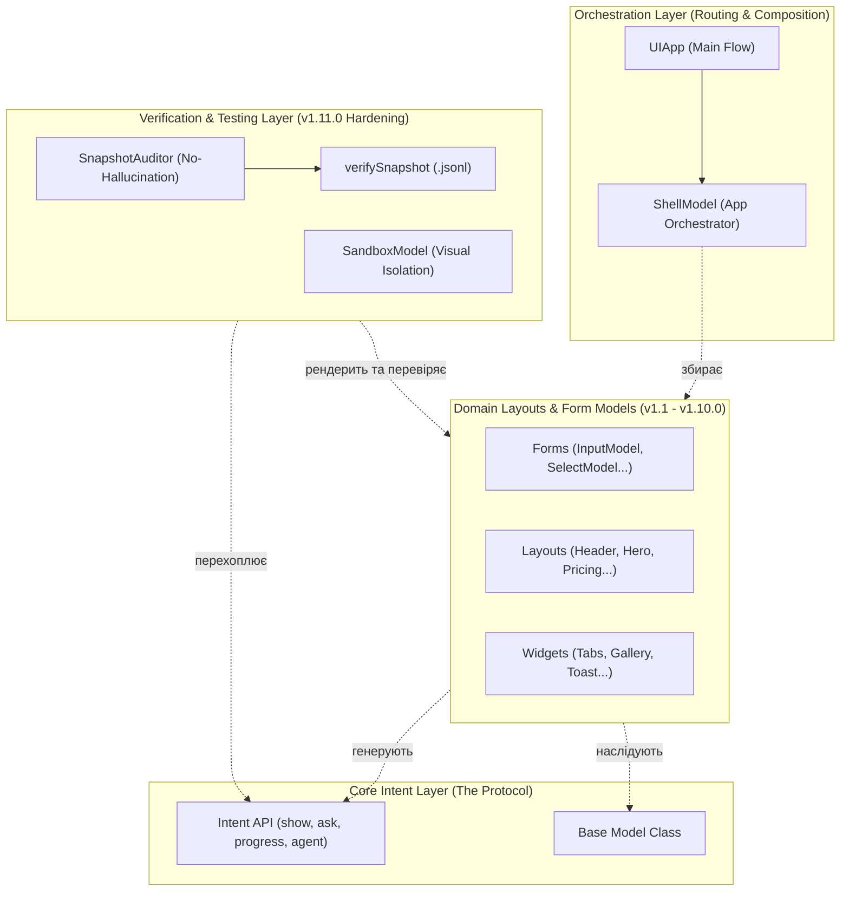

# Архітектура Пакету @nan0web/ui

[🏠 Головна (README)](../../README.md) | [📦 Мапа Компонентів (Моделей)](./architecture-models.md) | 🇬🇧 [English](./../../en/architecture.md)

Екосистема `@nan0web/ui` розроблена навколо концепції **"One Logic — Many UI" (OLMUI)**. Замість визначення, *як* відображати компоненти (React, CLI), цей пакет визначає виключно *наміри* (Intents) та *моделі даних* (Model-as-Schema).

Щоб уникнути перевантаження діаграми деталями мікро-імпортів, архітектуру пакету спрощено до ключових концептуальних шарів:

## Опис Функціональних Шарів

### 1. Orchestration Layer (Маршрутизація)
Це вершина ієрархії пакету. Файл `src/cli.js` експортує `UIApp` як точку входу за замовчуванням. Його завдання — ініціалізувати систему та передати контроль маршрутизації у `ShellModel`, яка діє як єдиний диригент екранів.

### 2. Core Intent Layer (Протокол)
Замість прямого виконання дій (наприклад, `console.log` або запит до бази), домен генерує "наміри". Це стабілізований у **v1.11.0** функціонал (методи `show()`, `agent()`, `ask()`), який згодом зчитується адаптерами (CLI, React, Mobile).

### 3. Domain Models Layer
Це "словник" складових блоків (дивись детальну мапу у [architecture-models.md](./architecture-models.md)). В релізі **v1.10.0** цей рівень розквітнув (*Domain Bloom*), поповнившись понад 20 новими структурними елементами (`HeaderModel`, `FooterModel`, `PricingModel`), чим завершив еволюцію пакету у повноцінний фреймворк для верстки.

### 4. Verification & Testing Layer 
Цей рівень отримав найбільшу увагу в релізі **v1.11.0**. 
- `SnapshotAuditor` та `verifySnapshot` гарантують, що доменні моделі генерують чисті інтенції без артефактів (`NaN`, `undefined`). 
- `SandboxModel` (запроваджена раніше, але сильно доповнена) дозволяє відокремити будь-який компонент з Domain-шару і протестувати його візуально в інтерактивному середовищі.
