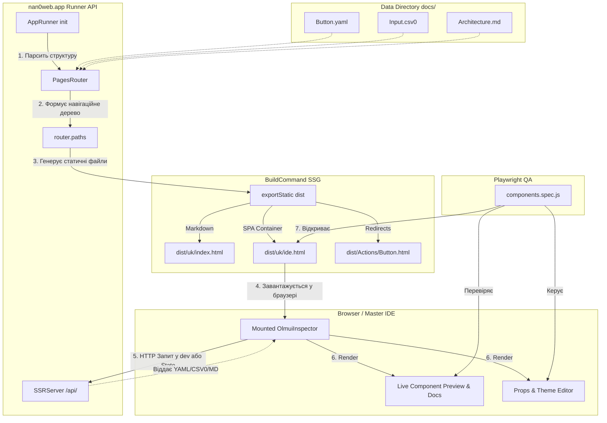

# Універсальна Архітектура Проєктів та UI Блоків (Universal Project & Blocks Spec)

> **Призначення:** Цей документ є обов'язковим стандартом (Конституцією) для старту або рефакторингу будь-якого проєкту в екосистемі `nan.web` (наприклад, `usarch.org`, `llimo.app`, фінансових додатків тощо). Він забезпечує єдність архітектури, ізоляцію абстракцій та Data-Driven UI.

---

## 🧭 Фаза 1: Філософія та Абстракція (The Seed)

_Перш ніж писати код, мИ визначаємо сутність проєкту та його місце в глобальній екосистемі._

1. **Місія та Філософія:**

   **Дані → Алгоритми → Додаток → Інтерфейси.**

   Фундаментальна ціль — побудувати систему, де **Дані** є першоджерелом; **Алгоритми** обробляють їх незалежно від середовища; **Додаток** (`*.app`) оркеструє бізнес-логіку; а **Інтерфейси** (`ui-*`) є точками взаємодії.

   **Взаємодія як Двигун:**
   Додаток — це безперервний процес взаємодії (Interaction) між системою та користувачем. Інтерфейс зобов'язаний не просто відображати стан, а бути активним учасником діалогу: запитувати дані, надавати варіанти вибору та фіксувати волю користувача.

   Жоден інтерфейс не створює власну логіку — він лише **проявляє** доменну логіку та забезпечує зворотний зв'язок.
   - `ui-cli` — мінімальний канонічний інтерфейс. Якщо логіку неможливо виразити в терміналі, значить вона ще не до кінця формалізована.
   - `ui-chat` — комунікаційний інтерфейс, що будується **поверх `ui-cli`**. Діалог з ШІ (LLiMo) використовує ті самі примітиви (`Input`, `Select`, `Table`, `Tree`), що й термінал, перетворюючи текстовий запит у формальні інтерактивні блоки.
   - `ui-react`, `ui-lit`, `ui-tauri`, `ui-web` — графічні інтерфейси; додають візуальну естетику та складні лейаути, але їхнім фундаментом залишається той самий протокол взаємодії.
   - `ui-voice` — голосовий інтерфейс, що будується **поверх `ui-chat`**.
   - `ui-robot` — інтерфейс для роботів.

2. **Абстракція (Базовий Додаток):**
   - **ЗАБОРОНЕНО** одразу писати жорстко прив'язаний UI для специфічного проєкту (напр. "UI для школи архетипіки").
   - **ОБОВ'ЯЗКОВО**: Визначити універсальний нан•додаток (напр., `@nan0web/learn.app`, `@nan0web/chat.app`, `@nan0web/shop.app`), розширюючи який мИ отримаємо наш проект. Проєкт (як `usarch`) лише налаштовує дизайн і застосовує ці базові модулі.
3. **Термінологія (Глосарій):**
   - Визначення термінів на рівні філософії співтворців ідеї і віртуалізації її у додаток.
   - Визначення термінів (Студент -> Member, Курс -> Course, тощо).

---

## 📁 Стандартна Структура Директорій (nan•app Structure)

Універсальний застосунок (`*.app`) або "Root Project", написаний з використанням екосистеми `UI`, повинен дотримуватись чіткого і мінімалістичного розділення логіки від даних та платформ:

```text
├── data/                 # Публічні дані проєкту (Data Directory)
│   ├── _/
│   │   └── langs.nan0    # Мови [{ title, locale, icon? }]
│   ├── en/               # Англійська мова
│   │   ├── _/
│   │   │   └── t.nan0    # Переклади
│   │   ├── index.nan0    # Головна сторінка
│   │   └── project.nan0  # Проєкт
│   ├── uk/               # Англійська мова
│   │   ├── _/
│   │   │   └── t.nan0    # Переклади
│   │   ├── index.nan0    # Головна сторінка
│   │   └── project.nan0  # Проєкт
│   └── index.nan0        # Головна сторінка
├── docs/                 # Документація як Єдине джерело правди (Knowledge Base)
│   ├── _/
│   │   └── langs.nan0    # Мови [{ title, locale, icon? }]
│   ├── en/               # Англійська мова
│   │   ├── README.md     # Документація проєкту згенерована з тестів
│   │   └── project.md    # Проєкт
│   └── uk/               # Українська мова
│       ├── README.md     # Документація проєкту згенерована з тестів
│       └── project.md    # Проєкт
├── play/                 # Пісочниця для експериментів (Playground)
│   ├── _/
│   │   └── langs.nan0    # Мови [{ title, locale, icon? }]
│   ├── en/               # Англійська мова
│   │   ├── _/
│   │   │   └── t.nan0    # Переклади
│   │   ├── index.nan0    # Головна сторінка
│   │   └── project.nan0  # Проєкт
│   ├── uk/               # Англійська мова
│   │   ├── _/
│   │   │   └── t.nan0    # Переклади
│   │   ├── index.nan0    # Головна сторінка
│   │   └── project.nan0  # Проєкт
│   └── index.nan0        # Головна сторінка
├── src/
│   ├── domain/           # Core Logic & Model-as-Schema (Платформо-незалежна логіка)
│   │   ├── Model.js      # Бізнес-сутність або Command (без прив'язки до Web/CLI)
│   │   └── utils.js      # Чисті функції обробки даних
│   ├── ui/
│   │   ├── api/          # API інтерфейс, middleware та власний router export { middleware, router }
│   │   ├── chat/         # Чат інтерфейс
│   │   ├── cli/          # Термінальний інтерфейс
│   │   ├── core/         # Базові компоненти інтерфейсу
│   │   ├── robot/        # Роботизований інтерфейс
│   │   ├── web/          # Веб інтерфейс
│   │   ├── voice/        # Голосовий інтерфейс
│   │   ├── tauri/        # Tauri інтерфейс
│   │   ├── kotlin/       # Android інтерфейс
│   │   └── swift/        # iOS інтерфейс
│   └── utils/            # Загальні утиліти
├── package.json          # Залежності, команди запуску (knip, test, docs:dev)
└── README.md             # Symlink або дзеркало до основних документів у всіх доступних мовах (у таблиці) docs/{defaultLang}/README.md
```

**Ключові правила структури:**

1. **`data/`** Це база даних додатку. Будь-який компонент інтерфейсу, налаштування чи контент повинні народжуватися звідси.
2. **`docs/`** Це документація проєкту для розробників.
3. **`play/`** Це пісочниця для експериментів.
4. **`src/domain/` ізольований:** Цей код нічого не знає про DOM, Terminal чи iOS. Він експортує `Model`, який "спілкується" через Intent генератори (`yield ask`, `yield show`, `yield progress`).
5. **Мультиплатформенність:** Якщо додаток підтримуватиме Swift чи Kotlin клієнти, вони будуть розташовані поряд (наприклад, `src/ui/swift/`), але використовуватимуть ту саму істинну доменну логіку (через FFI, JS-двигуни або API) і ті самі дані з `data/`.

Якщо додаток використовує лише стандартні компоненти nan•web, то потрібно прописати лише логіку в моделях у `src/domain/` та `data/` і додаток запрацює магічним чином через `nan0web.app` у всіх доступних UI або `nan0cli` у CLI.

---

## 📐 Фаза 2: Доменне Моделювання (Data-Driven Models)

_Опис даних, що керують інтерфейсом._

1. **Створення Model.js:**
   - Кожна сутність (Member, Product, Document) стає чистим JS класом у `src/domain/`.
   - Властивості описуються за шаблоном `static field = { help: "Field description", default: "", type: "type" }`.
   - _Що таке `type: "type"`?_ Це декларативна вказівка для Sovereign Sandbox IDE, який саме візуальний контроль використовувати для цього поля. Наприклад:
     - `type: "text/markdown"` — рендерить повноекранний текстовий редактор.
     - `type: "ref/Model"` — рендерить рекурсивну форму списку об'єктів.
     - `type: "ref/LessonModel[]"` — рендерить Autocomplete з вибором декількох тегів з реєстру `LessonModel`.
2. **Metadata Types (`@type`):**
   - Чітке визначення типів полів для автоматичної генерації UI: `text`, `number`, `boolean`, `text/markdown`, `ref/Model`, `ref/Model[]`, базові типи можуть визначатись за полем `default`.
3. **Data Sources (Джерела Даних як Основа):**
   - Базові дані зберігаються в `YAML`/`JSON` форматах. Вони є абсолютною істиною для додатку.
   - мИ відмовляємося від поняття 'Mocks', формуючи відразу живі Data Sources. Разом з децентралізованими чи хмарними рішеннями (напр. MongoDB), спеціальний адаптер (або синхронізація) копіює/вивантажує дані безпосередньо в ці формати. Увесь інтерфейс та логіка вибудовуються виключно навколо взаємодії з даними, які вже існують.

---

## 🛠 Фаза 3: Верифікація Логіки (CLI-First)

_Бізнес-логіка повинна на 100% працювати без веб-інтерфейсу і покриватись на 100% unit-тестами._

1. **Інтеграція з `ui-cli`:**
   - Створення команд через `adapter.select()` та `adapter.ask()`.
   - Можливість виконати всі задачі проєкту з терміналу (Створити курс, Видати сертифікат).
   - Покриття діалогів і потоків даних snapshot-тестами. Снепшоти тут — це текстові скріни логіки, що замінюють ручну перевірку.

---

## 🪐 Фаза 4: Sovereign Workbench (The Master IDE)

_Кожен проєкт має власну пісочницю (Sandbox) для швидкого управління даними та візуалізаціями._

1. **Підключення Models до Sandbox:**
   - Реєстрація всіх доменних моделей у `blocks-sandbox`.
2. **Тестування Data-Driven UI:**
   - Перевірка, як автоматично генерується інтерфейс на основі мета-описів домену (модальні вікна, списки, рілейшени).
   - Відображення `live-preview` карток та об'єктів.
3. **Інтеграція Документації (Docs in Sandbox):**
   - Кожен пакет та додаток зобов'язаний мати свою документацію, яка **безпосередньо інтегрована в Пісочницю**. Документація не повинна жити окремим життям.
   - Пісочниця разом із документацією збирається як дуже швидкий **SSG (Static Site Generator)** веб-додаток (на базі найшвидшого `ui-lit`), який легко публікується на GitLab Pages, GitHub Pages, Vercel, Cloudflare тощо.
   - Структура документації має бути професійною та глибокою — на рівні сучасних фреймворків на кшталт Bootstrap або React (із «живими» інтерактивними прикладами компонентів, зручною навігацією, архітектурним описом). Це може бути просто красиво відрендерений README + інші документи.

### Архітектура Master IDE та Data-Driven SSG

Master IDE (також відомий як пісочниця або `ide.html`) — це динамічний додаток та єдина точка входу до інспектування розроблених інтерфейсів. Відповідно до філософії Data-Driven UI, він працює з будь-якими файлами даних (`yaml`, `csv0`, `nan0`, `md`), а не лише з конфігурацією компонентів.

Ось як виглядає процес універсального рендерингу та SSG-генерації:



---

## 🎨 Фаза 5: Тематизація та Інтерфейс (Theming)

_Відокремлення логіки від бренду через CSS-змінні._

1. **Базовий UI (Base UI) та Брендування:**
   - Кожний нан•додаток (або проєкт) зобов'язаний мати спільний `Base UI` рівень, де зафіксовано його базові відтінки, кольори, брендування та типографіку.
   - Всі інші клієнти та репрезентації (`ui-react`, `ui-lit`, `ui-cli`, `ui-swift`, тощо) **імпортують і наслідують** змінні з цього рівня (через CSS Custom Properties або токени). Якщо мИ редагуємо базовий бренд-колір, ці зміни автоматично поширюються і на CLI, і на веб, і на інші платформи.
   - Графічні розширення (напр. веб-версія) можуть перевизначати стилі для себе безпосередньо, проте їхньою точкою падіння (fallback) безперечно є `Base UI` пакета.
2. **Конфігурація (Theme Configurator):**
   - Перевірка зміни стилів прямо з Sandbox без зміни JS коду компонентів.
3. **Універсальні Snapshot-тести (UI Snapshots):**
   - Як і у CLI, веб-компоненти (Lit / React) мають покриватися snapshot-тестами (фіксуючи їхню DOM-структуру). Снепшоти виступають як "скріни" коду для всіх інтерфейсів. Це доречний і найлегший шлях перевірити (і під час код-рев'ю і при CI), наскільки правильно алгоритми відпрацювали і чи не "зламався" інтерфейс після допрацювань.

---

## 🤖 Фаза 6: Автономна Взаємодія (Agentic Workflows & Inspectors)

_Платформа `nan.web` є AI-Native. Кожен пакет самостійно визначає, як штучний інтелект (LLiMo, LLM-субагенти) має з ним працювати, перевіряти код та навчатися._

Кожен пакет або нан•додаток може та повинен експортувати специфічні для своєї доменної області інструменти для штучного інтелекту:

### 1. `workflows/` (Експорт Робочих Процесів)

Будь-який пакет може експортувати свої `.md` воркфлоу, описуючи базовий (Basic Workflow) для роботи зі своїми сутностями.
**Де це вказується?** В конфігурації `package.json` (або `nan0web.config.js`):

```json
{
  "name": "@nan0web/markdown",
  "nan0web": {
    "workflowDir": "docs/{locale}/workflows",
    "workflows": ["basic.md", "advanced.md"],
    "inspectors": ["./src/inspectors/..."]
  }
}
```

### 2. Golden Standards (Наслідування Еталонних Моделей)

Пакет `@nan0web/types` (чи `@nan0web/core`) формалізує _основний_ Золотий Стандарт для опису моделей (Model-as-Schema). Усі інші пакети ТАКОЖ формують власні Золоті Стандарти, наслідуючись від ядра. Наприклад:

```javascript
import { Model } from '@nan0web/core'

/**
 * Золотий стандарт: пакет формалізує тип для "text/markdown".
 * Агенти (LLM) читатимуть цей файл, щоб зрозуміти як працює поле markdown.
 */
export class MarkdownContentModel extends Model {
  // Статична мета-схема (для UI-форм та LLM prompt-будівельників)
  static text = {
    type: 'text/markdown',
    help: 'Content strictly in CommonMark format',
    default: '',
  }

  constructor(data = {}, options = {}) {
    super(data, options)
    /** @type {string} */ this.text
  }
}
```

### 3. Індексація для Векторних Баз (RAG)

Що саме повинен індексувати ШІ-агент у векторній базі даних (Embeddings) для максимальної точності без галюцинацій?

- ✅ **ІНДЕКСУВАТИ:** Архітектурну документацію (`docs/*.md`, `project.md`, `system.md`).
- ✅ **ІНДЕКСУВАТИ:** Доменні моделі та контракти (`src/domain/*.js` та інтерфейси з чітким JSDoc), а також папки `workflows/`.
- ✅ **ІНДЕКСУВАТИ:** Дата-директорії (`docs/uk/**/*.yaml`, `.csv0`), бо це єдине джерело правди про стан додатка (Data-Driven).
- ❌ **ІГНОРУВАТИ:** Товсті файли з машинним/імперативним кодом парсерів (`src/server/`, `src/utils/`, CSS/SASS). Агент не повинен галюцинувати внутрішніми імплементаціями. Якщо LLM потрібен код парсера — вона прочитає його локально через `read_file`, але у векторі цього сміття бути не повинно.

### 4. Реєстр ШІ Знань (NaN0Web Store та NaN0AI)

Щоб не "роздувати" розмір NPM-пакунків (і уникати завантаження мегабайтів документації у `node_modules` кінцевого користувача), екосистема використовує інший підхід до дистрибуції ШІ-знань:

1. **Глобальний Реєстр (NaN0Web Store):** Це публічний GitHub-репозиторій (безкоштовний, надійний хостинг та версіонування). Він містить лише реєстр (маніфести, `Docs/`, та індекси), а НЕ дублікати вихідного коду всіх проектів.
2. **Посилання замість Дублікатів:** Щоб уникнути мегабайт сміття, Store зберігає посилання на конкретні Git-коміти/версії оригінальних репозиторіїв.
3. **Концепція "Headers vs Implementation":** За аналогією з C++ (де легкі `.h` файли відділені від важких `.cpp`), `NaN0AI` індексує лише "заголовки" — наші доменні абстракції (`Model-as-Schema`, `.d.ts`, та `workflows`), залишаючи імперативний вихідний код поза індексом. AI має бачити чисті контракти і ідеї, а не санітарну реалізацію.
4. **Обробка запитів інструментом `NaN0AI`:** Коли субагенту потрібні стандарти, він робить `git clone` реєстру NaN0Web Store, і через швидку векторну базу звертається до нього. Якщо ШІ потрібен повний source code програми для глибокого аналізу — `NaN0AI` завантажує його за посиланням з реєстру напряму у локальний кеш.

Така архітектура береже екосистему від зайвого навантаження, ізолює ШІ-пам'ять в одному ефективному сховищі (`Store`) і робить роботу агентів швидшою та стійкішою до "сміття".

### 5. AI-Експорт для пакета @nan0web/ui
Оскільки `ui` є фундаментальним пакетом, він за замовчуванням експортує наступний набір абстракцій:
- **Шляхи (Multilingual Workflows):** Воркфлоу є частиною архітектурної документації, тому вони живуть у мовних розділах: `docs/uk/workflows/` (та `docs/en/workflows/`).
- **Core Workflows:** `olm-ui-architecture.md`, `olm-ui-architecture-core.md`, `olm-ui-architecture-adapters.md`. Ці файли пояснюють агентам, як працює OLMUI.
- **Development Workflows:** `forge-component.md`, `interface-welding.md` (Контракт Зварювання). Описують покроковий процес створення нових чи підключення існуючих компонентів.
- **Inspectors:**
  - `SnapshotAuditor.js` (`src/domain/app/SnapshotAuditor.js`): Суверенний додаток-інспектор, який перевіряє стан Золотих та Робочих Снепшотів-галерей у всьому монорепозиторії.

---

## 🏁 Чек-лист готовності проєкту (Definition of Done)

- [ ] Є чітка місія у `system.md` або `README.md`.
- [ ] Проєкт розширює базовий додаток (Base App abstraction).
- [ ] Описані всі доменні моделі з підтримкою `@sandbox`.
- [ ] Всі сценарії можна пройти через CLI.
- [ ] Sandbox повністю керує даними та рендерить прев'ю.
- [ ] Компоненти UI не містять жорстко зашитих брендових кольорів, стилізація через CSS Custom Properties.

---

## 🧱 Універсальні UI Блоки (Universal Blocks Spec)

Відповідно до концепції **One Logic, Many UI (OLMUI)**, сторінки та інтерфейси збираються зі стандартних структур даних (блок-моделей). Ця специфікація описує єдину систему блоків (Blocks), які повинні підтримуватися всіма клієнтськими UI-пакетами.

## Мета

Єдиний підхід гарантує, що якщо мИ описуємо об'єкт у YAML чи JSON (наприклад, масив `$content`), цей об'єкт коректно обробляється:

- Рендериться у браузері через `ui-react` чи `ui-lit`.
- Виводиться у консоль через `ui-cli`.
- Аналізується LLM агентами як контекст через `ui-chat`.
- Озвучується через `ui-voice`.
- Виконується апаратними клієнтами через `ui-robo`.

---

## Матриця Підтримки Блоків (Специфікація)

У цій таблиці відображається статус імплементації кожного блоку в різних пакетах екосистеми `@nan0web/*`.

Легенда:

- ⏳ — Заплановано
- 🚧 — В розробці
- ✅ — Реалізовано
- ✖️ — Не застосовується (Not Applicable)

`ui-bs` — це скорочення від `ui-react-bootstrap`

| Блок / Компонент               | Структура (Payload)         | `ui-cli` | `ui-llm` | `ui-voice` | `ui-lit` | `ui-react` | `ui-bs` | `ui-robo` | Swift | Kotlin | `ui-tauri` |
| :----------------------------- | :-------------------------- | :------: | :------: | :--------: | :------: | :--------: | :-----: | :-------: | :---: | :----: | :--------: |
| **`Blocks.Description`**       | Підзаголовок (текст)        |    ⏳    |    ✅    |     ⏳     |    ⏳    |     ⏳     |   ✅    |    ⏳     |  ⏳   |   ⏳   |     ⏳     |
| **`Blocks.Excerpt`**           | Короткий опис/Summary       |    ⏳    |    ✅    |     ⏳     |    ⏳    |     ⏳     |   ✅    |    ⏳     |  ⏳   |   ⏳   |     ⏳     |
| **`Blocks.Content`**           | Основний масив сторінки     |    ⏳    |    ✅    |     ⏳     |    ⏳    |     ⏳     |   ✅    |    ⏳     |  ⏳   |   ⏳   |     ⏳     |
| **`Blocks.Accordion`**         | Питання-відповіді (FAQ)     |    ⏳    |    ✅    |     ⏳     |    ⏳    |     ⏳     |   ✅    |    ⏳     |  ⏳   |   ⏳   |     ⏳     |
| **`Blocks.Files`**             | Документи для завантаження  |    ⏳    |    ✅    |     ⏳     |    ⏳    |     ⏳     |   ✅    |    ⏳     |  ⏳   |   ⏳   |     ⏳     |
| **`Blocks.Features`**          | Переваги / Список фіч       |    ⏳    |    ✅    |     ⏳     |    ⏳    |     ⏳     |   ✅    |    ⏳     |  ⏳   |   ⏳   |     ⏳     |
| **`Blocks.Price`**             | Тарифи / Ціни               |    ⏳    |    ✅    |     ⏳     |    ⏳    |     ⏳     |   ✅    |    ⏳     |  ⏳   |   ⏳   |     ⏳     |
| **`Blocks.Contract`**          | Юридичні документи / Умови  |    ⏳    |    ✅    |     ⏳     |    ⏳    |     ⏳     |   ✅    |    ⏳     |  ⏳   |   ⏳   |     ⏳     |
| **`Blocks.Callout`**           | Tip, Warning, Info блоки    |    ⏳    |    ✅    |     ⏳     |    🚧    |     ⏳     |   ⏳    |    ⏳     |  ⏳   |   ⏳   |     ⏳     |
| **`Blocks.Markdown`**          | Типографіка (Текст)         |    ⏳    |    ✅    |     ⏳     |    🚧    |     ⏳     |   ⏳    |    ⏳     |  ⏳   |   ⏳   |     ⏳     |
| **`Layout.Page`**              | Каркас (Nav, Sidebar, Main) |    ✖️    |    ✖️    |     ✖️     |    🚧    |     ⏳     |   ⏳    |    ✖️     |  ⏳   |   ⏳   |     ⏳     |
| **`Layout.Nav`**               | Верхня навігація            |    ✖️    |    ✖️    |     ⏳     |    🚧    |     ⏳     |   ⏳    |    ✖️     |  ⏳   |   ⏳   |     ⏳     |
| **`Layout.Sidebar`**           | Бокове меню навігації       |    ✖️    |    ✖️    |     ⏳     |    🚧    |     ⏳     |   ⏳    |    ✖️     |  ⏳   |   ⏳   |     ⏳     |
| **`Control.ThemeToggle`**      | Перемикач День/Ніч          |    ✖️    |    ✖️    |     ✖️     |    🚧    |     ⏳     |   ⏳    |    ✖️     |  ⏳   |   ⏳   |     ⏳     |
| **`Control.LangSelect`**       | Перемикач мови              |    ⏳    |    ✖️    |     ⏳     |    🚧    |     ⏳     |   ⏳    |    ✖️     |  ⏳   |   ⏳   |     ⏳     |
| **`SectionNav`** _(Утиліта)_   | Навігаційні стрілки ↑↓      |    ✖️    |    ✖️    |     ✖️     |    ⏳    |     ⏳     |   ✅    |    ✖️     |  ✖️   |   ✖️   |     ✖️     |
| **`renderItem`** _(Ядро)_      | Рекурсивний рендерер тегів  |    ⏳    |    ✅    |     ⏳     |    ✅    |     ⏳     |   ✅    |    ⏳     |  ⏳   |   ⏳   |     ⏳     |
| **`layoutToContent`** _(Ядро)_ | Адаптація legacy `$layout`  |    ⏳    |    ✅    |     ✖️     |    ⏳    |     ⏳     |   ✅    |    ✖️     |  ⏳   |   ⏳   |     ⏳     |

---

## 🧱 Базові HTML Примітиви (Native Primitives)

Згідно з архітектурою **Data-Driven UI**, стандартний контент не потребує кастомних блоків типу `Blocks.Paragraph` чи `Blocks.Heading`.

Базовий рендерер (наприклад `renderItem` або `ui-lit`/`ui-react`) **автоматично** транслює нативні семантичні ключі безпосередньо у відповідні HTML-теги:

- Типографіка: `h1`, `h2`, `h3`, `p`, `blockquote`
- Списки: `ul`, `ol`, `li`
- Взаємодія: `a`, `button`
- Верстка: `div`, `span`, `hr`

Це дозволяє зберегти прозорість AST (напр. `{ "h1.gradient-text": "Заголовок" }` або `{ "h1": "Заголовок", $class: "gradient-text" }`) і уникнути зайвих обгорток для звичайного тексту.

---

## 🕹️ Інтерактивні В'ювери (Interactive Viewers & Inline Forms)

Окрім простого відображення лінійних компонентів, екосистема `@nan0web/ui` вимагає архітектурної підтримки складних інтерактивних елементів, які дозволяють користувачу взаємодіяти з даними та формами на одній сторінці (подібно до браузера, але працює як у вебі, так і в CLI-терміналі).

1. **`ContentViewer` (Interactive Layout):**
   Головний суверенний контрол, який отримує на вхід `content` масив (AST документа) і рендерить його у вікно із підтримкою скролу та фокусу.
   - **Навігація:** Вміє відрізняти пасивний текст від "інтерактивних" блоків (кнопки, посилання, суб-форми). Стрілки та клавіатура перемикають "фокус" між елементами.
   - **Footer:** Підтримує постійний footer статусу (наприклад, стан прочитаного у %, активні гарячі клавіші та кількість інтерактивних блоків навколо).
   - **Події:** Натискання на посилання (напр. `$href`) зупиняє в'ювер і передає подію роутеру (`navigate`).

2. **`FormViewer` (Menu & Object Map Editor):**
   Замість послідовного заповнення (як звичайний Input Prompt), `FormViewer` будує повноцінне "меню налаштувань" на основі опису моделі.
   - Користувач бачить усі поточні поля та їхні значення на екрані одночасно.
   - Фокус дозволяє переходити між полями, відкривати/редагувати обране значення (`Sub-Prompt`) і повертатися назад до меню перед кліком на «Зберегти».

3. **`Inline Forms` (Згорнуті Sub-Models):**
   При рендерингу складних сторінок, як-от форма реєстрації або відгуку всередині статті:
   - Об'єкт виду `App.Feedback.Form: true \n $collapsed: true` рендериться інтегровано (in-line).
   - В'ювер згортає форму до одного блоку. Після кліку на неї — поточний `ContentViewer` зберігає свій стан, відкриває `FormViewer` (або `ask` prompt), збирає дані, а потім повертає управління батьківському в'юверу.

Цей підхід є ядром єдиного UX (One Logic - Many UI) для всіх платформ.

---

## 🧩 Додаткові App-Компоненти (nan•apps)

Важливо зазначити, що блоки бізнес-логіки **не входять** до базової специфікації `ui`, а є частиною відповідних суверенних нан•додатків (`.app`). Універсальний UI лише надає механізм "Реєстру Компонентів", куди ці додатки себе реєструють.

Для App-компонентів прийнято використовувати простір імен `App.<AppNamespace>.<ComponentName>` замість глобального префіксу `ui-*`. Це чітко вказує, з якого нан•додатка походить компонент, і дозволяє уникнути конфліктів.

- **`App.Auth.LogIn`** або **`App.Auth.SignUp`** (Форми логіну, реєстрації, гейти) — частина модулю/додатку **`auth.app`**.
- **`App.Pay.Checkout`** (Криптооплата, фіат, перевірка статусу) — частина **`pay.app`** (або `billing.app`).
- **`App.LLiMo.Chat`** (Інтерфейс AI-діалогів, LLiMo) — частина **`llimo.app`** або `SunIntelligence`.

Вони можуть викликатись в єдиному AST дереві, проте їхня реалізація міститься поза межами ядра `ui`. В рантаймі (наприклад, у `ui-lit`) рендерер через локальний реєстр знайде відповідність між ключем `App.Auth.LogIn` та конкретним веб-компонентом (наприклад, `<app-auth-login>`).

### Вирішення колізій (Namespace Collisions)

Цей механізм є **універсальним** для будь-якої реалізації Data-Driven UI на платформі `nan0web` (чи то `ui-lit`, `ui-react`, чи `ui-cli`). Щоб уникнути конфліктів, коли різні розробники створюють додатки з однаковими назвами (наприклад, два різних `chat.app`), використовується патерн **Scoped Configuration (Локальні Аліаси)**.

Замість того, щоб плагін "жорстко" реєстрував власні компоненти (чи теги) глобально, він просто експортує свій маніфест компонентів. Головний додаток вирішує колізії ізольовано:

```javascript
import yaroChatManifest from 'yaro-chat.app'
import acmeChatManifest from 'acme-chat.app'

// Головний застосунок розподіляє простори імен:
uiLitApp.registerApps({
  // Відтепер ключі AST "App.Chat.*" належать плагіну yaroChat
  Chat: yaroChatManifest,

  // Ключі AST "App.SupportChat.*" належатимуть acmeChat
  SupportChat: acmeChatManifest,
})
```

Завдяки цьому підходу, AST моделі залишаються чистими і гнучкими, а розв'язання конфліктів повністю делегується конфігуратору кінцевого застосунку.

---

## 🏗️ Архітектурні вимоги до реалізації

1. **Незалежність**: Кожен Блок отримує лише специфічні для нього дані (props). Жодний Блок не знає про "сторінку" цілком.
2. **Типізація**: Структура (Payload) блоків базується на парадигмі **Model as Schema** — одна спільна модель описує дані та їх валідацію.
3. **Єдиний Експорт**: Кожен UI пакет (наприклад `@nan0web/ui-react-bootstrap`) має експортувати єдину функцію `renderItem()`, яка є точкою входу для опрацювання структури.

## Робочий процес імплементації нового блоку

1. Якщо Блок є стандартним — він додається до цієї таблиці.
2. Реалізація створюється у потрібному пакеті (починаємо зазвичай з `ui-react-bootstrap`).
3. Вимагається відшліфувати Блок у локальній **Пісочниці (Playground/Sandbox)** відповідного пакета перед тим, як інтегрувати його у фінальні додатки.
4. Запустити тести. Якщо пісочниця і тести "зелені", маркуємо блок як ✅ у матриці.

---

## 🧪 Інструментарій: Пісочниця Компонентів (Sandbox)

**Sandbox** (Пісочниця) — це спеціалізований інструментарій (редактор) для тестування, візуального налаштування та створення варіацій (екземплярів) будь-якого компонента із загального реєстру блоків.

Кожен блок або компонент (наприклад, `Blocks.Accordion` або `App.Auth.LogIn`) має підтримувати налаштовувані змінні: базові налаштування, стилі, відступи, кольори або специфічні властивості (`props`) за замовчуванням.

**Можливості Sandbox:**

1. Візуально налаштовувати кожен компонент.
2. Створювати та зберігати безліч екземплярів (варіацій) одного компонента (наприклад, варіація "Червона кнопка", "Темний аккордеон" тощо).
3. Надавати менеджерам сайту чи адміністраторам можливість самостійно створювати свої теми з компонентами та змінювати дизайн без залучення спеціалістів.

### Структура даних (Моделі Sandbox)

Збереження стану налаштувань зазвичай реалізовується у браузері, щоб гарантувати високу швидкість відгуку редактора.

**1. `SandboxVariant`** — представляє збережений екземпляр (варіацію) компонента:

```javascript
/**
 * Every instance of the class must be saved in IndexedDB.
 */
class SandboxVariant {
  /** @type {string} Variant title */
  title = ''
  /** @type {number} Variant order */
  order = 0
  /** @type {string} Component name */
  component = ''
  /** @type {string} Target URL of selected page for render the component */
  url = ''
  /** @type {Object<string, any>} Component props */
  props = {}
}
```

**2. `SandboxConfig`** — глобальні налаштування самої пісочниці:

```javascript
/**
 * Global config for the sandbox might be stored in localStorage or IndexedDB.
 */
class SandboxConfig {
  /** @type {'tabs' | 'list' | 'grid'} View mode */
  view = 'tabs'
}
```

### 🎯 Уніфікація UX (Поведінкові вимоги до Sandbox)

Незалежно від платформи (`ui-react`, `ui-lit` чи термінальний `ui-cli`), кожна пісочниця повинна дотримуватись однакових стандартів користувацького досвіду:

1. **Редагування та Збереження (Edit & Save)**: Будь-які зміни `props` мають застосовуватись до поточного екземпляра варіації та надійно зберігатися (у `IndexedDB`, `localStorage` або локальний JSON-файл для CLI). Після перезапуску пісочниці зміни не повинні втрачатись.
2. **Керування Варіаціями (Variation Management)**:
   - Можливість створювати **нові варіації** для будь-якого компонента (наприклад, "Кнопка: Червона", "Кнопка: Синя").
   - Можливість **видаляти** існуючі кастомні варіації.
3. **Скидання налаштувань (Reset to defaults)**: Наявність опції швидкого скидання властивостей `props` до базових заводських значень (`defaultProps`) компонента.
4. **Запасні значення (Fallbacks)**: Якщо певне поле (наприклад, `children`) повертається пустим або його видалено, компонент в режимі Sandbox має рендерити значення за замовчуванням (або демо-контент), замість помилок чи `undefined`.
5. **Підтримка всіх типів контролів (All UI Controls)**: Пісочниця має інтегрувати та надавати можливість тестувати **усі** компоненти, які експортуються UI-бібліотекою. Наприклад, для `ui-cli` це як і статичні (Views: `Alert`, `Badge`, `Toast`), так і інтерактивні (Prompts: `Input`, `Select`, `Toggle`, `Confirm`).
6. **E2E Testing & Snapshots (Автоматизація тестування)**: Пісочниця (в ідеалі) має підтримувати рендер/збереження компонентів таким чином, щоб на них можна було накладати Snapshot-тестування. Усі варіації компонентів повинні бути готові до створення "золотих" скріншотів (Snapshot/Golden Masters) або E2E тестів (Playwright), які перевіряють, що конкретна варіація рендериться без помилок і без змін верстки після оновлень ядра (як у візуальному веб-інтерфейсі `ui-lit`, `ui-react`, `ui-swift`, `ui-kotlin`, так у `ui-cli`, і в `ui-chat`).
7. **Ієрархія (Hierarchical Resolution)**: Налаштування через Sandbox має працювати ієрархічно: від меншого до більшого. Якщо базовий пакет (напр. `@nan0web/ui-react-bootstrap`) має свої компоненти у Sandbox, то всі вони автоматично імпортуються і реєструються у Sandbox основного мікро-додатку. Якщо цей мікро-додаток використовується ще більшим додатком — його Sandbox-компоненти інтегруються також (аж до кінцевого проєкту). Це дозволяє на рівні кінцевого застосунку бачити **усі** вбудовані компоненти, тестувати їх, змінювати тему і проганяти через власні Snapshot/E2E тести в контексті фінального продукту.

### 📱 Архітектура Швидкого Тестування (Мілісекундний Model-as-App)

Головний принцип екосистеми: **тестувати код максимально швидко без залучення браузерного E2E-середовища на кшталт Playwright там, де воно непотрібне**.

1. **Model-as-App (Тестування в Мілісекундах)**: Вся логіка (від валідації до багатоетапних бізнес-діалогів) тестується виключно на рівні Node.js (V8) через чисті Intent/Scenarios. Ці тести виконуються за лічені мілісекунди. Модель перевіряє сама себе.
2. **Роль Компонентів (Рендер Сценаріїв)**: UI-компоненти не містять логіки. Вони лише **відмальовують** готові стани. Їх також можна тестувати миттєво (через SSR snapshot-генератори та DOM снепшоти без повноцінного браузера).

#### Playwright (End-to-End) — Як Крайній Засіб:
Playwright використовується **тільки** для фінального наскрізного візуального прогону (QA). Компоненти `ui` тестуються автоматизованим E2E на 5 розмірах вікна (viewports), щоб виявити накладання верстки на різних пристроях:
1. **375px** — Мобільні пристрої (Mobile Портрет).
2. **768px** — Планшети (Tablet Портрет).
3. **1024px** — Планшети (Tablet Ландшафт / Малі лептопи).
4. **1200px** — Десктопи (Standard Desktop).
5. **1920px** — Великі екрани (Large / Full HD Desktop).

Такий розподіл гарантує блискавичну швидкість розробки (95% тестів завершуються за мить) і абсолютну надійність верстки (завдяки 5% важких E2E тестів у Master IDE).
