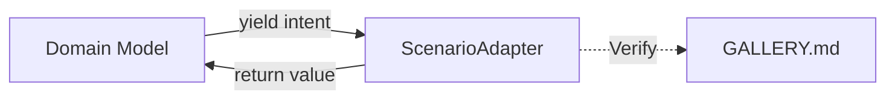

# Завдання Релізу v1.11.0 — Architecture Consolidation

[English](./task.en.md) | [Українська](./task.md)

## Мета (Scope)

Даний реліз фокусується на стабілізації архітектурних контрактів @nan0web/ui, вдосконаленні `Intent.js` та інтеграції патчу тестування (OLMUI v2.0 Hardening Patch). 

### 1. OLMUI v2.0 Hardening Patch (Testing)
Завершення винесення логіки збереження `.jsonl` зліпків (JSON Lines) та Fail-Fast тестування. `verifySnapshot` експортується та зберігає масиви логічних інтенцій у `snapshots/jsonl/`.

### 2. Intent API Stabilization
Функції `ask`, `progress`, `result`, `show`, `render` експортуються як повноцінні іменовані функції (вирішення `TS2694`). `show()` генерує коректний LogIntent. Впроваджено `AgentIntent` та допоміжну функцію `agent()`. Тимчасові таймаути адаптерів скорочені для запобігання блокування Event Loop (Node.js 3333ms limits).

### 3. ShellModel та Snapshot Auditor
`ShellModel` переведено на статичний словник `UI`, позбавляючись від ручних `switch`. Перетворення інспекторів тестування на `SnapshotRunner.js` та `SnapshotAuditor.js` для пошуку галюцинацій (NaN, undefined).

### 4. V8 Optimization та Типізація
Виправлення антипатерну **"Class field outside constructor"** у доменних класах. `EmptyStateModel`, `BannerModel`, `ProfileDropdownModel` офіційно доступні через основний об'єкт `Model`.

### 5. Deterministic Scenario Testing & Arch Healing
Впроваджено `ScenarioTest` (клас в `src/test/ScenarioTest.js`), що піднімає `flow` з переданою моделлю та `ScenarioAdapter`. Це дозволяє передавати набір відповідей та миттєво перевіряти результат виконання моделі без I/O. Виправлено антипатерни в `DepsCommand.js`, `Props.js`, `InterfaceTemplate.js`, `Message.js`, `OutputMessage.js`, `StreamEntry.js`, `StdIn.js`. Перенесено `LayoutModel.js` до `src/domain/`.

## Критерії Прийомки (Definition of Done)

- [x] Функції Intent API експортуються як іменовані, а не const-змінні. `TS2694` вирішено.
- [x] `verifySnapshot` зберігає зліпки коректно.
- [x] Таймаути тестів поважають `timeoutMs=3333`.
- [x] Snapshot Auditor підтримує `SnapshotScore` та валідує файли.
- [x] Відсутні `class fields outside constructor` у всіх моделях та базових компонентах ядра.
- [x] Усі регресійні тести та перевірки проходять успішно (досягнута 100% сумісність з v1.10).
- [x] Контрактні тести (`task.spec.js`) написані для `ScenarioAdapter` і успішно проходять (Green).
- [x] `ScenarioTest` дозволяє детерміновано тестувати сценарії моделі (без I/O).

## Architecture Audit (Чекліст)

- [x] Чи прочитано Індекси екосистеми? Так, інструменти адаптовано під стандарти.
- [x] Чи існують аналоги в пакетах? Ми розширюємо єдиний механізм інтенцій.
- [x] Джерела даних: У цьому релізі модифікуються внутрішні JS файли (без нових YAML).
- [x] Чи відповідає UI-стандарту? Так, `show` додає гнучкість для міжплатформового відображення повідомлень.
# Seed: @nan0web/ui (Zero-Hallucination UI Framework)

## 1. Сутність та Мета
Ядро фреймворку NaN0Web, що реалізує паттерн **One Logic — Many UI (OLMUI)**. Забезпечує контракт інтенцій (Intents) між бізнес-логікою (Моделями) та інтерфейсами (Адаптерами).

## 2. Ключові Досягнення

### 2.1. Покращений ModelAsApp (v2.1)
Оновлено базовий конструктор `ModelAsApp` для забезпечення безпечної дефолтної поведінки "з коробки":
- **Вбудований i18n-парсер**: Якщо `t` (перекладач) не передано, модель використовує власну логіку підстановки змінних через `{key}` та заміну підкреслень на пробіли. Це гарантує читабельність інтерфейсу навіть без підключеної бази перекладів.
- **Ін'єкція залежностей**: Поля `plugins`, `adapter` та `t` автоматично ініціалізуються в приватному об'єкті `#appOptions`.

### 2.2. Deterministic Scenario Testing (ScenarioAdapter)
Замість ручного тестування в терміналі впроваджується паттерн **Deterministic Scenario Adapter**.
- **Мета**: Миттєве тестування бізнес-сценаріїв (Edge Cases, Validation Errors) без затримок на I/O.
- **Механіка**: Адаптер отримує заздалегідь підготовлений масив відповідей (`Scenario`) і синхронно повертає їх на кожен `ask` інтент.
- **Швидкість**: Пробіг по 100+ сценаріях займає мілісекунди.

## 3. Діаграма Архітектури


## 4. План впровадження
- [x] Перенесення логіки `ModelAsApp` з `ui-cli` в `ui` (Core).
- [x] Створення базового `ScenarioAdapter` у `packages/ui/src/test/ScenarioAdapter.js`.
- [x] Перенесення моделей `Content` та `Document` зі специфічної платформи `ui-cli` до базового `ui/src/domain/`.
- [ ] Інтеграція `ScenarioTest` у загальний пайплайн верифікації.

## 5. Глобальний Словник OLMUI (Ванільна Категоризація та Розширення Типів)
Замість складної прив'язки типів через TypeScript `interface`, екосистема використовує нативний **JSDoc Intersection (`&`)** у чистому Vanilla JS для категоризації та розширення типів.

### 5.1. Базові Словники (Еталон у `@nan0web/ui`)
Ядро `@nan0web/ui` формує єдине джерело правди (`ContentData`) через злиття двох первинних словників:

**Словник №1: Стандартний HTML5**
```javascript
/** 
 * @typedef {Object} HTML5Elements
 * @property {string|ContentData[]} [div] - Блоковий контейнер
 * @property {string|ContentData[]} [span] - Рядковий контейнер
 * @property {string|ContentData[]} [h1] ... [h6] - Заголовки
 * @property {string|ContentData[]} [p] - Абзац
 * @property {string|ContentData[]} [a] - Посилання
 * @property {any} [img] - Зображення
 * @property {ContentData[]} [ul] 
 * @property {ContentData[]} [ol]
 * @property {ContentData[]} [li]
 * @property {ContentData[]} [table]
 * // ... всі інші стандартні HTML5 теги
 */
```

**Словник №2: Nan0Web Base UI (Core Components)**
```javascript
/** 
 * @typedef {Object} CoreUIElements
 * @property {import('./components/FormModel.js').FormModel} [form]
 * @property {import('./components/SliderModel.js').SliderModel} [slider]
 * @property {import('./components/ButtonModel.js').ButtonModel} [button]
 * @property {import('./components/SelectModel.js').SelectModel} [select]
 * @property {import('./components/ToggleModel.js').ToggleModel} [toggle]
 * @property {ContentData[]} [sortable] - Інтерактивний Drag-n-Drop контейнер
 * // ... всі інші базові форми та компоненти 
 */
```

**ФУНДАМЕНТ OLMUI**: 
`/** @typedef {Partial<HTML5Elements & CoreUIElements> & Record<string, any>} ContentData */`

### 5.2. Еталон Розширення Додатками (Auth.app, Share.app тощо)
Оскільки `ContentData` базово покриває практично всі стандартні веб-інтерфейси, специфічні додатки (Apps) додають лише свій високоріневий бізнес-UI через перетин типів (`&`):

```javascript
import { Content } from '@nan0web/ui'

// 1. Auth.app додає свої віджети
/** @typedef {Object} AuthAppElements
 * @property {any} [loginForm]
 * @property {any} [registrationForm]
 */

// 2. Share.app додає свої віджети
/** @typedef {Object} ShareAppElements
 * @property {any} [shareButtons]
 * @property {any} [commentSection]
 */

// 3. Фінальний словник специфічного клієнта
/** @typedef {import('@nan0web/ui').ContentData & AuthAppElements & ShareAppElements} AppContentData */

/** @type {AppContentData} */
const doc = { 
    div: [
        { h1: "Welcome" },
        { loginForm: { redirect: "/dashboard" } },
        { commentSection: { postId: 123 } }
    ] 
} // 100% Автокомпліт в IDE для БУДЬ-ЯКОГО тегу чи віджету
```
Цей механізм гарантує повну модульність, нульовий (`0 байт`) вплив на розмір бандлу і залізобетонну типізацію на будь-якій вкладеності рекурсивних вузлів.

### 5.3. Єдиний стандарт ключів (camelCase) та робота Адаптерів

**Правило Data-Driven UI (Model-as-Schema):**
Усі ключі в даних (YAML, JSON, `.nan0`), як однослівні (`alert`, `accordion`), так і багатослівні (`featureGrid`, `profileDropdown`), повинні міститися **строго в `camelCase` (або `lowercase`) форматі**. Це гарантує:
1. Автокомпліт в IDE.
2. Легкий доступ JS: `content.featureGrid` замість `content['feature-grid']`.

**Як Адаптери обробляють ці ключі:**
- **Web-адаптери (Lit / HTMLElements)**: Автоматично перетворюють camelCase-ключі моделі на `kebab-case` HTML-теги. Наприклад: `featureGrid` → `<ui-feature-grid>`, `alert` → `<ui-alert>`.
- **React-адаптери**: Маплять `camelCase` на `PascalCase` компоненти (напр., `<FeatureGrid />`).
- **CLI-адаптер (`ui-cli`)**: Рендерить базові HTML5-компоненти за допомогою внутрішнього мапінгу:
  - `h1`..`h6` → Використовує жирний шрифт (chalk) або ASCII-арт.
  - `p`, `span` → Текстові блоки (chalk).
  - `ul`, `ol` → Додає префікси (маркери або нумерацію) перед children.
  - Багатослівні OLMUI віджети (`featureGrid`) → Делегує рендеринг відповідним Text-based UI Components або виводить їх як табличні структури.

## 6. Model-as-Schema vs Model-as-App (Lazy Loading Стратегія)
Архітектура забороняє ініціалізувати всі моделі під час парсингу великого дерева `Content` (Model-as-Schema). 

**Еталон поведінки:**
1. **Режим Рендеру (Model-as-Schema)**: 
   Сирі дані прямо з `ContentData` (наприклад, стаття в Markdown) передаються View-компонентам без `new Model(...)`. Моделі підвантажуються ("ліниво") ТІЛЬКИ при відкритті сторінки в режимі РЕДАКТОРА або АДМІНІСТРАТОРА (для побудови Form/Schema).
2. **Режим Рантайму (Model-as-App)**: 
   Коли віджет інтерактивний (наприклад `FormModel` або `SliderModel`), адаптер (або UI-компонент) завантажує відповідний клас-модель через `const ModelClass = await import('./SliderModel.js')` *виключно в момент ініціалізації*. Це гарантує, що валідація вводу спрацює, а пам'ять мобільного/веб-пристрою не постраждає від "монструозних" ініціалізацій на старті сесії.

## 7. OLMUI Inspector / Auditor (`UIInspector`)
Для закріплення "Hard-Typed" філософії створюється стандарт перевірки (Auditor), який інтегрується у команду `nan0cli inspect-models`.

**Обов'язки `UIInspector`:**
1. Перевіряє, що всі моделі в `ui/src/domain/components/` експортують JSDoc JSDoc `typedef` для своїх параметрів (наприклад `SliderOptions`).
2. Забороняє прямі масові імпорти (`import { SliderModel } from ...`) всередині рендер-циклів адаптерів. Вимагає використання `await import()`.
3. Вимагає використання JSDoc Intersection (`&`) для розширення `ContentData` у платформних пакетах.
4. Перевіряє, чи не використовується `any` замість масиву `ContentData[]` у рекурсивних вузлах.
